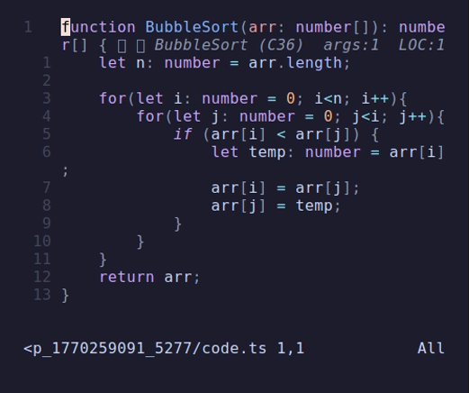
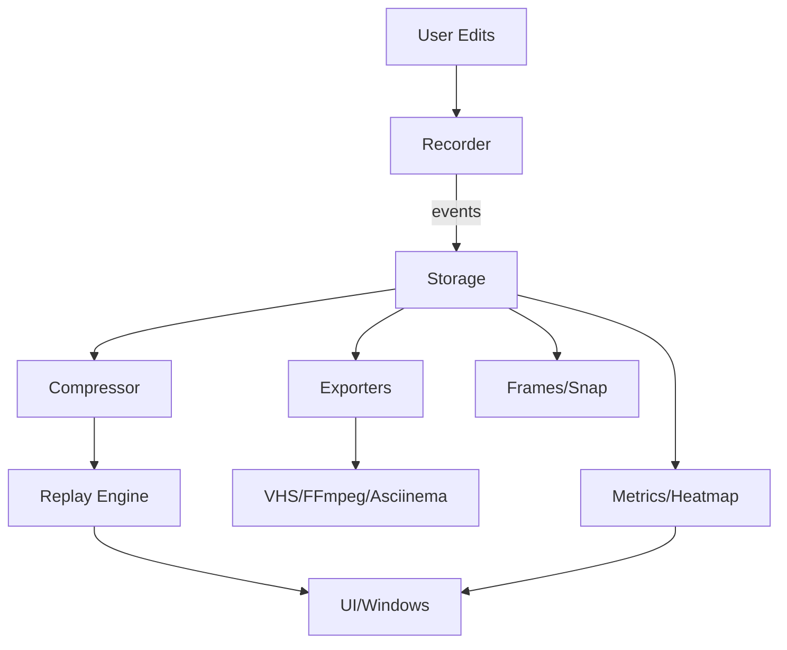

# neoreplay.nvim

**Timelapse replay for Neovim.**

Stop re-reading finished code. Replay how it was built, one step at a time. This isn't a keystroke recorder; it's an edit-event engine that captures the evolution of your buffer.

## 10-Second Usage

1. Start recording a session:
  `:NeoReplayStart` (or `:NeoReplayStart all_buffers=true`)
2. Write some code, refactor, edit.
3. Stop recording:
   `:NeoReplayStop`
4. Replay the session in a floating window:
   `:NeoReplayPlay`

## Chronos: The Time Traveler

Forgot to start NeoReplay? No problem. **Chronos mode** excavates your Neovim undo tree, reconstructs the timeline of your edits, and replays them as if you had been recording the whole time.

> **Recommended:** Keep your undo history persistent for best Chronos results:
> `vim.opt.undofile = true`

- **Command**: `:NeoReplayChronos`
- **Flex Mode**: `:NeoReplayFlexChronos` (100x speed archeology)

## Example



## Features

- **Recording**: Captures buffer diffs via `nvim_buf_attach`, ignoring cursor movements and noise.
- **Intelligent Compression**: Merges identical line-range edits happening in short bursts into single steps.
- **Chronos (Undo Replay)**: Forgot to record? Excavate your buffer's undo tree to reconstruct history.
- **Scene Tracks**: Multi-buffer capture and replay in a synchronized scene.
- **Overlays**: During replay, labels like *insert / delete / replace* with cadence indicators.
- **Fidelity Guarantee**: The replay engine ensures the final state of the replay buffer perfectly matches the original session.
- **Minimal UI**: Simple floating window with speed controls.
- **Interactive Progress Bar**: Scrub, seek, and preview edits with mouse and keyboard while replaying.
- **Fullscreen Replay**: Toggle fullscreen during playback, including multi-buffer scenes.
- **Heat Map Overlay**: Visualize edit intensity across the buffer with a 10-level color gradient.
- **Metrics Dashboard**: Real-time session analytics (LOC history, edit breakdown, terminal commands).
- **Smart Bookmarks**: Automatic landmark generation for significant code changes (functions, large edits).
- **Social Media Exports**: 9:16 (Shorts/TikTok) and 1:1 (Instagram) presets with mobile-optimized font sizes.
- **Environment Themes**: Coordinated VHS and Neovim aesthetics for professional "presentation-ready" exports.

## Core Principles

- **No heavy dependencies inside Neovim** → Optional capability packs (VHS, FFmpeg, asciinema).
- **No native video encoding** → Export pipelines (VHS/FFmpeg/frames/asciinema).
- **No keystroke visualization** → Semantic overlays and cadence instead of raw keys.
- **No multi-buffer sync** → Scene tracks with focus buffer support.

## How it Works (Automatic Background Exports)

One minor detail: Neovim is a text editor, not a video encoder. To keep the plugin light and fast, we don't include a heavy MP4 encoder. Instead, we use an **automatic scripting bridge**:

1. **Recording**: We capture buffer events.
2. **Export**: `:NeoReplayExportGIF` or `:NeoReplayExportMP4` generates a unique temporary `.tape` file for [VHS](https://github.com/charmbracelet/vhs).
3. **Background Generation**: NeoReplay automatically starts a background job to run VHS. It opens a headless terminal, runs the replay, and saves it as a high-quality GIF or MP4.
4. **Notification**: You'll receive a notification when the export starts and another when it's finished, letting you continue coding without manual command-line intervention.

## Architecture (Abstract)



## Export Output Locations (Defaults)

- **Base export directory**: `~/.neoreplay`
- **VHS**: `~/.neoreplay/neoreplay.tape` (tape) + output file in current working directory unless `filename=...`
- **Frames**: `~/.neoreplay/frames/`
- **Asciinema**: `~/.neoreplay/neoreplay_asciinema.sh` (script) and `~/.neoreplay/neoreplay.cast`
- **FFmpeg**: `~/.neoreplay/neoreplay_capture.mp4`
- **Raw session export**: `~/.neoreplay/neoreplay_session.json`

All exporters accept overrides (e.g. `filename=...`, `dir=...`, `json_path=...`, `tape_path=...`).

### Video/GIF Export & Snapshots (Automatic)

All video and image exports are performed **automatically in the background**.

| Command | Usage | Description |
|---------|-------|-------------|
| `:NeoReplaySnap` | `:NeoReplaySnap` | **Snapshot**: Capture selection as a PNG/JPG. Copies to system clipboard by default. |
| `:NeoReplayExportGIF` | `:NeoReplayExportGIF speed=20` | Automatically generate a GIF via VHS in the background. |
| `:NeoReplayExportMP4` | `:NeoReplayExportMP4 quality=90` | Automatically generate an MP4 via VHS in the background. |
| `:NeoReplayRecordFFmpeg`| `:NeoReplayRecordFFmpeg` | **Wild Mode**: Direct screen capture via FFmpeg. |
| `:NeoReplayExportFrames` | `:NeoReplayExportFrames dir=~/frames` | Export per-event JSON frames for external renderers. |
| `:NeoReplayExportAsciinema` | `:NeoReplayExportAsciinema speed=20` | Generate an asciinema capture script. |
| `:NeoReplayExportShorts` | `:NeoReplayExportShorts out.mp4` | **Social**: 9:16 export for Shorts/TikTok. |
| `:NeoReplayExportInstagram`| `:NeoReplayExportInstagram` | **Social**: Square (1:1) export for Instagram. |

## Advanced Analysis & Visualization

NeoReplay isn't just for watching; it's for understanding.

### Metrics Dashboard
Invoke `:NeoReplayDashboard` to see a performance summary of your session:
- **LOC History**: Sparkline of your code growth.
- **Edit Types**: Breakdown of insertions, deletions, and modifications.
- **Command Log**: List of terminal commands run during the recording.

### Heat Map
Use `:NeoReplayHeatmapToggle` to visualize "hot" areas of your code. Lines with high edit frequency glow with higher intensity (Blue $\rightarrow$ Red), helping you identify complex sections that required multiple iterations.

### Smart Bookmarks
landmarks are automatically created when you add new functions or make significant changes.
- **Manual Bookmark**: `:NeoReplayBookmark`
- **Navigate**: `:NeoReplayBookmarkNext` and `:NeoReplayBookmarkPrev`
- **Visuals**: Bookmarks appear as icons on the progress bar for easy seeking.

## NeoReplaySnap: High-Quality Code Captures

Transform your code into beautiful images directly from Neovim.

- **Command**: `:NeoReplaySnap` (Works in Normal and Visual mode)
- **Visual Mode**: Select the code lines you want and run `:NeoReplaySnap`.
- **Fidelity**: Uses [VHS](https://github.com/charmbracelet/vhs) to render a headless Neovim frame loading your actual `$MYVIMRC`. This means your **Treesitter**, **theme**, **icons**, and **line numbers** are perfectly preserved.
- **Clipboard Integration**: Once generated, the image is automatically copied to your system clipboard (requires `wl-copy` or `xclip`). Use `snap_clipboard = false` to disable.
- **Requirements**: Only [VHS](https://github.com/charmbracelet/vhs). (FFmpeg is **not** required for snapshots.)
- **Location**: Snapshots are saved to `~/.neoreplay/snaps/`.

**Options**:
- `format=png|jpg` (Default: `png`, `jpeg` is treated as `jpg`)
- `font_size=16`
- `clipboard=true` (Auto-copy to system clipboard using `xclip` or `wl-copy`)
- `name="my_awesome_code"` (Custom filename, extension auto-added if missing)
- `use_user_config=true|false` (Whether to load your `init.lua`, default `true`)
- `fit_to_content=true|false` (Default: `true`, size image to selection bounds)
- `padding=0` (Override snapshot padding in pixels)

### Configuration (setup)

You can configure snapshots and other features in the `setup` function:

```lua
require('neoreplay').setup({
  -- Default directory for snapshots
  snap_dir = "~/Pictures/code_snaps", 
  
  -- Automatically copy snapshots to clipboard
  snap_clipboard = true,

  -- Snap sizing
  snap_fit_to_content = true,

  -- Export options
  export = {
    use_user_config = true, -- Load your nvim config for exports/snaps
  },

  -- Keymaps
  keymaps = {
    snap = "<leader>rS", -- Map in both Normal (buffer) and Visual (selection) mode
  }
})
```


*Example*: Select lines and run `:'<,'>NeoReplaySnap clipboard=true name="refactor_win"`

*Configurable parameters for VHS:* `speed` (multiplier), `quality` (1-100), `filename`.

> **Note on FFmpeg Record**: The `:NeoReplayRecordFFmpeg` command captures your actual Neovim window live using `x11grab`. It requires `ffmpeg` and `xwininfo` (on Linux).

> **Note on Asciinema Export**: `:NeoReplayExportAsciinema` generates a script that *records* a new asciinema cast. Run the script first, then play the resulting `.cast`:
>
> 1) `~/.neoreplay/neoreplay_asciinema.sh`
> 2) `asciinema play ~/.neoreplay/neoreplay.cast`
>
> The generated script now uses the absolute NeoReplay runtimepath, so you can run it from any directory.

This gives you perfectly crisp, pixel-perfect clips without bloating your Neovim installation.

## Installation

Using [lazy.nvim](https://github.com/folke/lazy.nvim):

```lua
{
  "theawakener0/neoreplay.nvim",
}
```

## Configuration

NeoReplay works out of the box, but you can tune the experience:

| Option | Type | Default | Description |
|--------|------|---------|-------------|
| `ignore_whitespace` | `boolean` | `false` | If true, edits that only change whitespace will not be recorded. |
| `record_all_buffers` | `boolean` | `false` | If true, record all loaded file buffers (scene tracks). |
| `playback_speed` | `number` | `20.0` | Default speed for replay and exports. |
| `vhs_theme` | `string` | `nil` | Override the VHS theme (e.g., "Nord"). |
| `vhs_mappings` | `table` | `{}` | Key-value pairs of Neovim colorschemes to VHS themes. |
| `snap_fit_to_content` | `boolean` | `true` | Size snapshots to the selected buffer content. |
| `export` | `table` | `{}` | Export-time options (see below). |
| `keymaps` | `table` | `{}` | Optional keymaps for commands (`start`, `stop`, `play`, `chronos`). |
| `controls` | `table` | `{}` | Override replay control keys (`quit`, `quit_alt`, `pause`, `faster`, `slower`). |

### Export Options

| Option | Type | Default | Description |
|--------|------|---------|-------------|
| `export.use_user_config` | `boolean` | `false` | Load your user config during VHS/asciinema export (for Treesitter, plugins, etc). |
| `export.nvim_init` | `string` | `nil` | Path to an explicit Neovim init file for export sessions. Overrides `use_user_config`. |
| `export.fullscreen` | `boolean` | `true` | Run export replays in fullscreen mode. |
| `export.ui_chrome` | `boolean` | `false` | Show replay chrome (border + control winbar) during export. |
| `export.progress_bar` | `boolean` | `false` | Show the progress bar during export. |

### Copy-Paste Config (Full)

```lua
require("neoreplay").setup({
  ignore_whitespace = false,
  record_all_buffers = false,
  playback_speed = 20.0,
  snap_clipboard = true,
  -- Map your custom colorscheme to a VHS theme
  vhs_mappings = {
    ["rose-pine"] = "Rose Pine",
  },
  export = {
    use_user_config = true,
    -- nvim_init = "/absolute/path/to/init.lua",
    -- fullscreen = true,
    -- ui_chrome = false,
    -- progress_bar = false,
  },
  keymaps = {
    snap = "<leader>rS", -- Map in both Normal (buffer) and Visual (selection) mode
    start = "<leader>rs",
    stop = "<leader>rt",
    play = "<leader>rp",
    flex = "<leader>rf",
    chronos = "<leader>rc",
    clear = "<leader>rx",
    export_gif = "<leader>rg",
    export_mp4 = "<leader>rm",
    export_frames = "<leader>rF",
    export_asciinema = "<leader>ra",
    record_ffmpeg = "<leader>rr",
  }
  ,controls = {
    quit = "q",
    quit_alt = "<Esc>",
    pause = "<space>",
    faster = "=",
    slower = "-",
  }
})
```

## Controls (During Replay)

When the replay window is open, use these keys:
- `Space`: Pause / Resume
- `=`: Speed up
- `-`: Slow down
- `q` / `Esc`: Close replay
- `f`: Toggle fullscreen

### Progress Bar Controls

The progress bar updates in real time with elapsed/total time, percentage, play/pause state, and the active buffer name.

When the progress bar is visible:

- **Mouse**: Click to seek, drag to scrub, hover to preview.
- **Keyboard**:
  - `h` / `l`: Seek -5s / +5s
  - `H` / `L`: Seek -30s / +30s
  - `0`: Seek to start
  - `G` / `$`: Seek to end

### Seek Commands

You can also seek via commands during playback:

| Command | Usage | Description |
|---------|-------|-------------|
| `:NeoReplaySeek` | `:NeoReplaySeek 42` | Seek to a percentage of the session (0–100). |
| `:NeoReplaySeekForward` | `:NeoReplaySeekForward 5` | Seek forward by N seconds (default 5). |
| `:NeoReplaySeekBackward` | `:NeoReplaySeekBackward 5` | Seek backward by N seconds (default 5). |
| `:NeoReplaySeekToStart` | `:NeoReplaySeekToStart` | Jump to the beginning. |
| `:NeoReplaySeekToEnd` | `:NeoReplaySeekToEnd` | Jump to the end. |

## VHS Themes

All available VHS themes are bundled. Use `:NeoReplayVHSThemes` to open the full list in a scratch buffer, or set `vhs_theme` directly to any theme name.

## License

MIT - See [LICENSE](LICENSE) for details.

## Acknowledgements

| Project | Contribution |
|:---|:---|
| **[VHS](https://github.com/charmbracelet/vhs)** | High-quality GIF and MP4 export engine. |
| **[asciinema](https://github.com/asciinema/asciinema)** | Terminal session recording and playback. |
| **[FFmpeg](https://github.com/FFmpeg/FFmpeg)** | Video processing and direct screen capture. |
| **[Hack Club](https://github.com/hackclub)** | A wonderful community of builders. |

